# Spoke

I built this for the CipherSchools LLD practice assignment. It is a small web app where you pick a problem, lock clarifying questions, put down types, walk one use case, submit, and get feedback that does **not** depend on matching some blog’s class names.

Live: https://spoke-lld-practice.vercel.app  
Repo notes for the assignment: [SUBMISSION.md](SUBMISSION.md) · [RESEARCH.md](RESEARCH.md) · [DESIGN.md](DESIGN.md) · [AI_USAGE.md](AI_USAGE.md)

Quickest path through the product: **Parking Lot → Start attempt → Load example → Submit**.

| | |
| --- | --- |
| Stack | Next.js (App Router), TypeScript, a JSON file for attempts |
| Problems | Vending Machine, Parking Lot, Meeting Room Scheduler, In-memory Cache, Elevator |
| Scoring | Deterministic coverage / graph / walkthrough / scope. Optional LLM for prose only |
| Auth | None |

There is a day/night toggle and a Home button in the header.

## Screenshots

Theme is saved in `localStorage` as `spoke-theme`. First visit follows the OS.

<p align="center">
  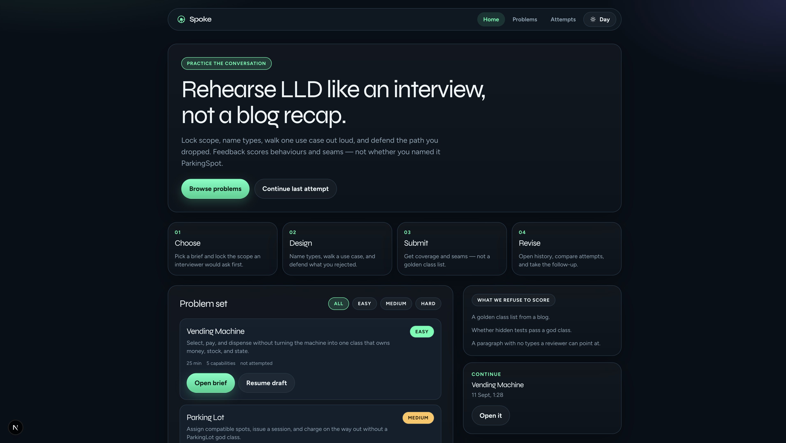
  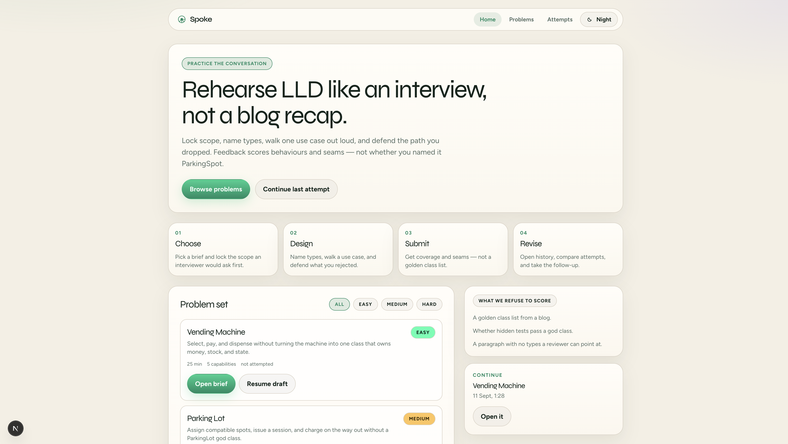
</p>

Home, night and day.

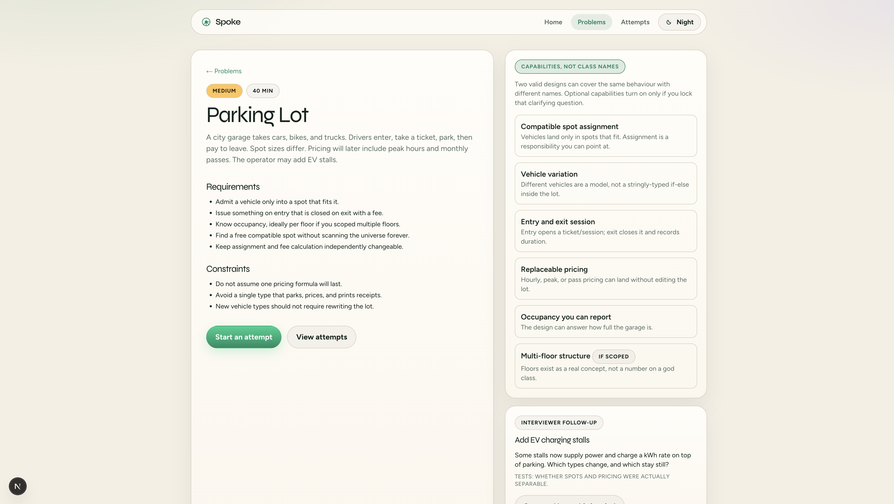

Brief for Parking Lot. Capabilities are behaviours, not required class names. Follow-up is on the right.

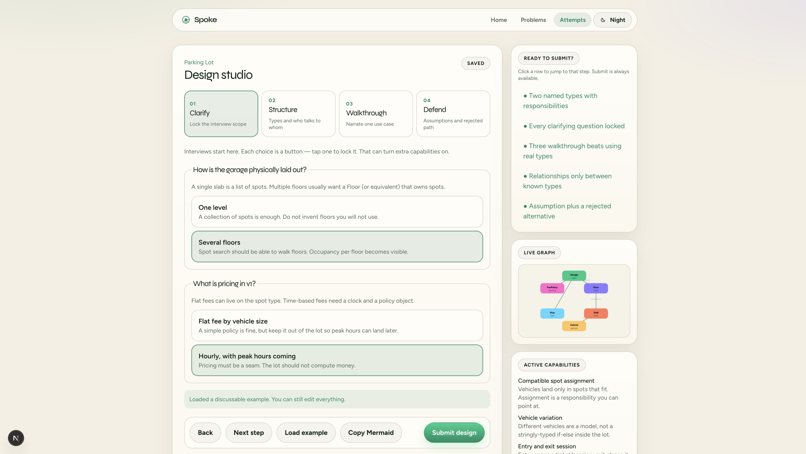

Studio steps: Clarify, Structure, Walkthrough, Defend. Graph updates from the types you named.

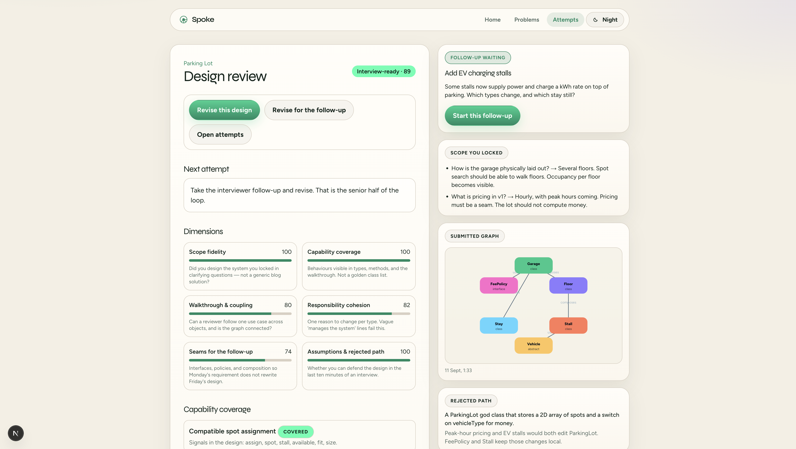

Review. Band + evidence. You can revise or take the interviewer follow-up.

<p align="center">
  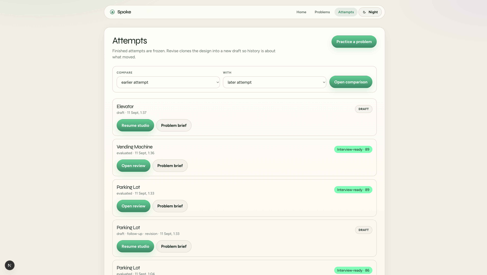
  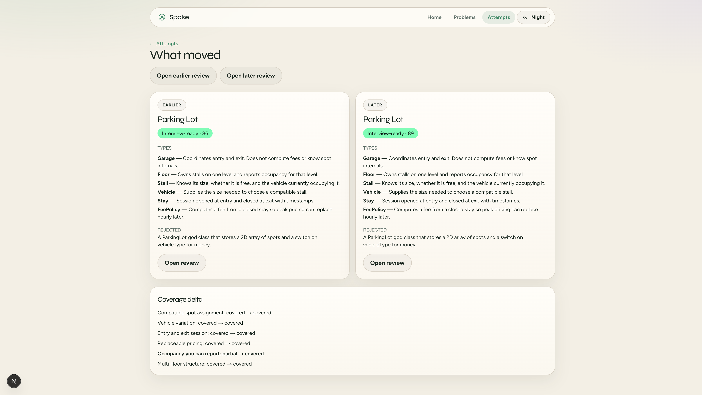
</p>

Finished attempts stay as they were. Compare is just “what moved”. Revise makes a new draft.

## The loop I was aiming for

Most people “practice” LLD by copying a GitHub Parking Lot or dumping boxes into ChatGPT. That skips the actual interview: clarify, talk through a use case, defend a trade-off.

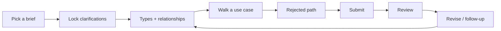

1. Catalog of five problems. Filter easy/medium/hard. Last score stays on the card.
2. Brief: requirements, constraints, capabilities, follow-up.
3. Studio in four steps, because that is how the round usually goes.
4. Review with a band (fragile / developing / solid / interview-ready) and evidence you can argue with.
5. History. Revise clones. Follow-up revise copies the design and writes the extra prompt into notes.

Submit is always enabled. If the design is incomplete, `validateForSubmit` throws and the API returns 400. I did not want a greyed-out button that hides the real rule.

## High-level architecture

One Next.js process. Locally attempts sit in `data/attempts.json`. On Vercel I write under `/tmp/spoke` because the disk is not durable. Routes do not talk to the file or to OpenAI themselves. Everything goes through `PracticeService`.

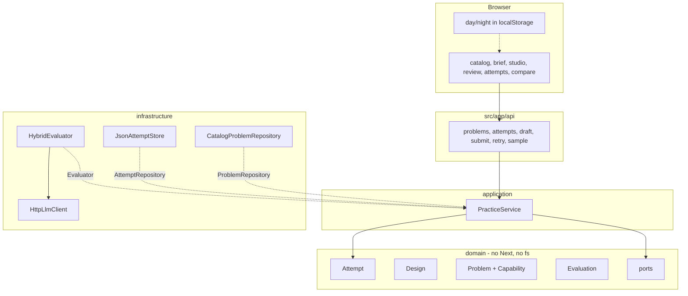

Folder layout:

```
src/
  domain/          Attempt, Design, Problem, ports, errors
  catalog/         the five briefs + two worked examples
  evaluation/      deterministic checker, optional LLM, hybrid wrapper
  application/     PracticeService
  infrastructure/  json store, clock, uuid, HTTP LLM client
  app/             pages + API
  components/      header, theme toggle, graph
```

I put ports in so I can swap things later without rewriting Attempt:

| Port | Right now | If this grew |
| --- | --- | --- |
| ProblemRepository | in-memory list | yaml / db |
| AttemptRepository | json file | sqlite |
| Evaluator | HybridEvaluator | extra checkers, human review |
| LlmClient | OpenAI-compatible HTTP | local model or nothing |
| Clock / IdGenerator | system time + uuid | frozen in tests |

### What happens on submit

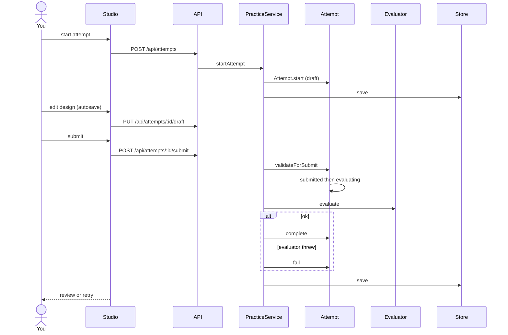

## Low-level design

I treated the platform the same way I would treat Parking Lot. Domain objects do not import Next.js or `fs`. HTTP is just an adapter.

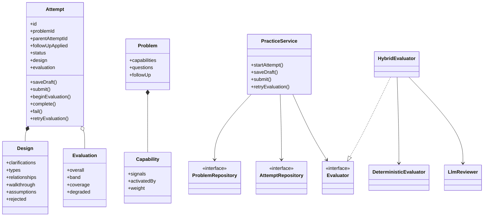

### Attempt states

You cannot edit a finished attempt. Revise = new Attempt with `parentAttemptId`. Follow-up does the same and prepends the interviewer prompt to notes.

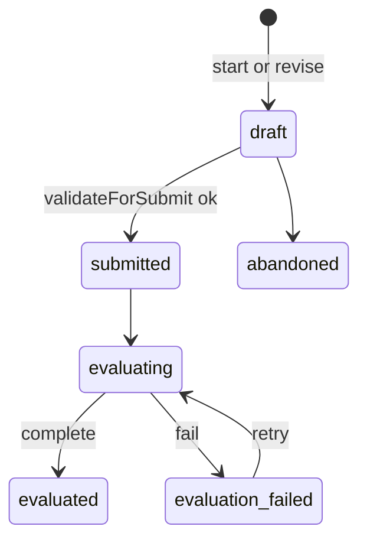

### How scoring works

The checker always runs:

- Capability coverage from signals in names, methods, walkthrough, etc. Two hits = covered. `Stall` still counts for assignment (there is a test).
- Graph smells: god class, vague “manages the system” lines, leftover types, inheritance-only.
- Walkthrough actually uses types you named, and more than one actor.
- If you locked “several floors”, the writeup has to mention floors.
- At least one assumption and a rejected alternative.

LLM is optional and only allowed to add prose (strengths, extra concerns, “this other shape fits when…”, interviewer questions). It is not allowed to invent a correct class list. Names that are not in the submission get stripped. Missing key, timeout (~10s), or junk JSON: attempt still finishes, `degraded=true`. If `evaluate()` itself throws, status is `evaluation_failed` and you retry the same attempt.

| Failure | Status | What you see |
| --- | --- | --- |
| Incomplete design | stays draft | message from the domain, HTTP 400 |
| No key / timeout / bad JSON | evaluated, degraded | normal deterministic review |
| Evaluator crash | evaluation_failed | Retry. Design is untouched |

Scores are six dimensions. The UI mostly shows the band, not the integer, because the integer is diagnostic.

## Run it

Node 20+.

```bash
npm install
npm test
npm run dev
```

http://localhost:3000

```bash
cp .env.example .env.local
# OPENAI_API_KEY=...   optional
```

`npm test` covers the state machine, Stall-vs-ParkingSpot coverage, optional capabilities from clarifications, god class, LLM throw → degraded, crash → retry, revise copy, follow-up seed.

## Deploy

`vercel.json` is just `{ "framework": "nextjs" }`. I shipped it at https://spoke-lld-practice.vercel.app.

If you deploy your own: `npx vercel --prod`. Remember the json store on Vercel is ephemeral.

## What I did not build

Login, contest timer, a real UML canvas, Kubernetes, microservices, hidden JUnit.

Would have made a bigger repo. Would not have made a better LLD argument for this assignment.

Known holes: signal matching can light up if you get lucky with words. The number is not a ranking. The graph is a layout of your types, not a modelling tool.
