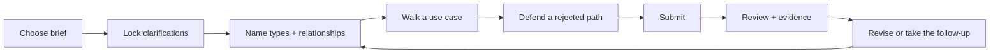
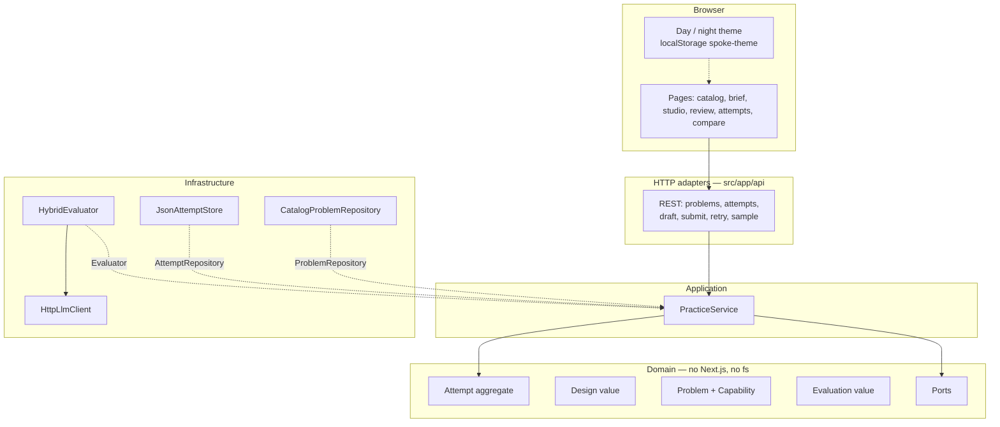
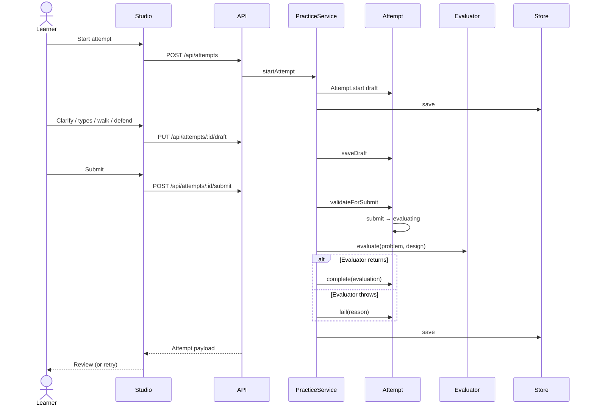
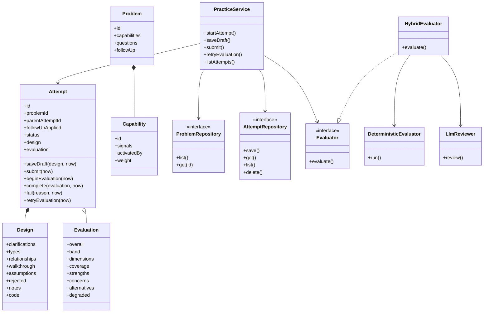
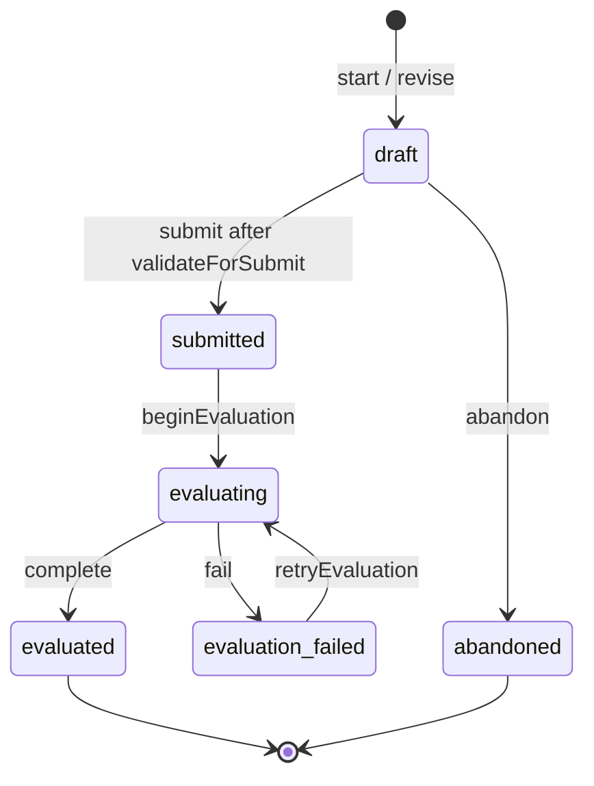

# Spoke — LLD practice studio

Rehearse a **low-level design interview** the way it actually runs: lock scope, name types, walk one use case out loud, defend the path you dropped, then get feedback that scores **behaviours and seams** — not whether you named it `ParkingSpot`.

| | |
| --- | --- |
| Stack | Next.js (App Router) + TypeScript domain layer + JSON store |
| Problems | Vending Machine, Parking Lot, Meeting Room Scheduler, In-memory Cache, Elevator |
| Evaluation | Deterministic coverage, graph, walkthrough, and scope checks. Optional LLM on top. |
| Auth | None. One local learner, on purpose. |

Quick demo: **Parking Lot → Start an attempt → Load a discussable example → Submit**.

---

## Screenshots

Day and night mode live in the header (`Home` · `Problems` · `Attempts` · theme toggle). Theme is stored as `spoke-theme` in `localStorage` and follows the OS preference on first visit.

<p align="center">
  
  
</p>

<p align="center"><em>Home / catalog — night and day. Difficulty filters, last attempt, and the practice loop.</em></p>


<p align="center"><em>Brief — requirements, constraints, capabilities (not class names), interviewer follow-up.</em></p>


<p align="center"><em>Studio — Clarify → Structure → Walkthrough → Defend, live graph, always-available submit.</em></p>


<p align="center"><em>Review — band, dimensions with evidence, coverage, revise / follow-up.</em></p>

<p align="center">
  
  
</p>

<p align="center"><em>History is frozen. Compare shows what moved. Revise clones; it never patches a finished attempt.</em></p>

---

## Why this exists

People “practice” LLD by copying a GitHub Parking Lot or pasting boxes into a chatbot. Three things break:

1. **Answer keys.** If you named `Stall` instead of `ParkingSpot`, writeups tell you that you are wrong.
2. **Tests that pass a god class.** Machine-coding IDEs check behaviour. A 400-line `ParkingLot` still parks cars.
3. **Skipping the interview.** Real rounds start with clarifying questions and a narrated use case. A bag of classes is not that conversation.

Spoke makes the **defensible design artifact** the unit of practice. Evaluation scores **capabilities and seams**, so two valid shapes can both pass.

Longer writeup: [RESEARCH.md](RESEARCH.md). Design decisions: [DESIGN.md](DESIGN.md). What I kept vs rejected from the model: [AI_USAGE.md](AI_USAGE.md).

---

## Practice loop



1. **Catalog** — five briefs. Filter by difficulty. Last band on a problem stays visible. **Home** is always in the header.
2. **Brief** — requirements, constraints, capabilities (behaviours, not class names), and the interviewer follow-up.
3. **Studio** — four steps the interview actually has:
   - Clarify (answers can activate extra capabilities, e.g. multi-floor)
   - Structure (types + relationships + live graph)
   - Walkthrough (actor → action → collaborator → outcome)
   - Defend (assumptions + rejected path; code is optional)
4. **Review** — band, evidence you can argue with, next-attempt focus, other valid shapes.
5. **History** — finished attempts are frozen. Revise clones. Compare two attempts. “Revise for the follow-up” seeds the extension prompt into notes.

Submit is always clickable. Incomplete designs still hit `validateForSubmit` in the domain and come back with a concrete error. That rule is not a disabled button with no model behind it.

---

## High-level architecture

One Next.js process. One `data/attempts.json` file locally (on Vercel, `/tmp/spoke` because the filesystem is ephemeral). HTTP never talks to the store or the LLM directly. **`PracticeService` is the only use-case layer.**



```
src/
  domain/          Attempt aggregate, Design, Problem, ports, errors
  catalog/         Five briefs + worked examples
  evaluation/      Deterministic engine, optional LLM, hybrid
  application/     PracticeService
  infrastructure/  JSON store, clock, ids, HTTP LLM client
  app/             UI + API adapters
  components/      Shell, theme toggle, live graph
```

Ports worth swapping later, without rewriting `Attempt`:

| Port | Now | Later |
| --- | --- | --- |
| `ProblemRepository` | In-memory catalog | YAML / DB |
| `AttemptRepository` | JSON file | SQLite / Postgres |
| `Evaluator` | `HybridEvaluator` | Machine-coding tests, human review |
| `LlmClient` | OpenAI-compatible HTTP | Local model, no-op |
| `Clock` / `IdGenerator` | System clock + UUID | Frozen clock in tests |

### Request flow



---

## Low-level design

Domain types do not import Next.js or `fs`. The platform is modelled the same way the problems are: types with one reason to change, ports at the seams.



### Attempt state machine

Finished attempts are immutable. **Revise** = new aggregate with `parentAttemptId`. Follow-up revise copies the design and prepends `Follow-up: …` into notes.



### Evaluation (LLD)

**Always (deterministic).** Signal matching against capabilities so `Stall` still covers assignment. Graph smells (god class, vague responsibilities, isolated types, inheritance-only). Walkthrough coherence (real types, a core verb, not self-talk). Scope fidelity (if you locked multi-floor, floors have to show up). Defense thickness.

**Optional LLM.** Gets the problem, *your* types only, and the deterministic notes. Forbidden from inventing a correct class list. Unknown type names are stripped. If the key is missing, the call times out (~10s), or JSON is junk: the attempt still completes with `degraded=true`.

Coverage scores are never owned by the model.

| What fails | Attempt status | Learner sees |
| --- | --- | --- |
| Incomplete design | stays `draft` | Domain message, HTTP 400 |
| Missing key / timeout / junk JSON | `evaluated` (`degraded`) | Full deterministic review |
| `Evaluator.evaluate` throws | `evaluation_failed` | Retry. Submission untouched |

Dimensions: scope, coverage, collaboration, cohesion, extensibility, defense. The UI leads with a **band** (fragile / developing / solid / interview-ready), not the integer.

---

## Run locally

Node 20+.

```bash
npm install
npm test
npm run dev
```

App: [http://localhost:3000](http://localhost:3000)

Optional LLM:

```bash
cp .env.example .env.local
# set OPENAI_API_KEY
```

Without a key, feedback is fully usable. That is the default path.

Pinned tests:

- Attempt state machine and invalid submissions
- Coverage without golden class names (`Stall` covers assignment)
- Clarification-activated capabilities
- God-class penalty
- LLM throw → degraded success
- Evaluator crash → `evaluation_failed` → retry
- Revision copy does not mutate the parent
- Follow-up revise seeds the interviewer prompt

---

## Deploy

The app is a standard Next.js project (`vercel.json` sets `"framework": "nextjs"`).

```bash
npx vercel --prod
```

Or connect the GitHub repo to Vercel and deploy on push.

On Vercel the attempt store writes under `/tmp/spoke` (set automatically via `VERCEL`). History can reset when the instance recycles. For a durable store, swap `JsonAttemptStore` behind `AttemptRepository`. Optional: set `OPENAI_API_KEY` in the project env for qualitative review.

---

## Scope I refused

Accounts, timed contest mode, a full UML canvas, Kubernetes, microservices, hidden JUnit.

Those would make a larger repo. They would not make a stronger LLD argument.

Known limits: signal matching can false-positive on lucky vocabulary; the integer score is diagnostic, not a ranking; the graph is a layout of your types, not Enterprise Architect.
